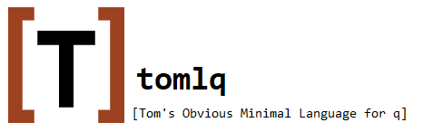

# 

## Introduction

Programming language q has a native JSON parser but JSON is not the only format for a configuration file. However, XML is tab intensive and YAML requires careful space insertion. Here, Tom's Obvious Minimal Language (TOML) is friendly for both human and program.

tomlq is a TOML file parser for q. You don't need to care notrious `null` value any more. You don't need the headach of attributes. Just write fair-looking configuration file and parse it.

## Type Mapping

|q|TOML|
|---|---|
|bool|bool|
|long|int|
|float|double|
|symbol|string (length <= 30)|
|timestamp|timesatamp *[<span style="color: red; ">1</span>]|
|date|date|
|time|time|
|list of bool|array of bool|
|list of long|array of int|
|list of float|array of double|
|string|string (length > 30)|
|list of symbol|array of string *[<span style="color: red; ">2</span>]|
|list of timetamp|array of timestamp *[<span style="color: red; ">1</span>]|
|list of date|array of date|
|list of time|array of time|
|compound list|array of array, array of table, array of mixture|
|dictionary|table|

*[<span style="color: red; ">1</span>]: Millisecond precision<br/>
*[<span style="color: red; ">2</span>]: Length of each symbol must be 63

## Installation

tomlq uses CMake to build and install the shared library. The available option at installation is `CMAKE_INSTALL_PREFIX` which defines a root of the install destination. If the option is not passed the artefact is installed to `${QHOME}/[os]` where `[os]` is `l64`, `w64` etc.

The example below installs `tomlq.so` to `tomlq/install/`.

```sh
tomlq]$ mkdir install
tomlq]$ mkdir cmake
tomlq]$ cd cmake
cmake]$ cmake -DCMAKE_INSTALL_PREFIX="../install" ../
cmake]$ cmake --build . --target install
```

## Using tomlq

For users who installed tomlq outside of `${QHOME}/[os]`, there is a custom environmental variable to help user to load teh library successfully:
- `Q_LIBRARY_PATH`: Absolute path to the directory where `tomlq.so` exists

The example below assumes you installed tomlq library under `tomlq/install/`.

```sh
tomlq]$ (export Q_LIBRARY_PATH=$(pwd)/install; q q/toml.q)
```
```q
q).toml.load `:file/sample.toml
title   | `TOML Example
owner   | `name`dob!(`Tom Preston-Werner;1979.05.27D15:32:00.000000000)
database| `enabled`ports`data`temp_targets!(1b;8000 8001 8002;(``phi;,3.14);`..
servers | `alpha`beta!+`ip`role!(`10.0.0.1`10.0.0.2;`frontend`backend)
```

## Test

Testing tomlq uses `test_helper_function.q` which is placed under `tests/` directory of [kdbplus](https://github.com/diamondrod/kdbplus).
```sh
tomlq]$ wget https://raw.githubusercontent.com/diamondrod/kdbplus/master/tests/test_helper_function.q -O tests/test_helper_function.q
tomlq]$ q tests/test.q
test result: ok. 19 passed; 0 failed
```

## License

This library is licensed under MIT license.

## Note

This library is utilizing [`tomlc99`](https://github.com/cktan/tomlc99) under MIT License.
